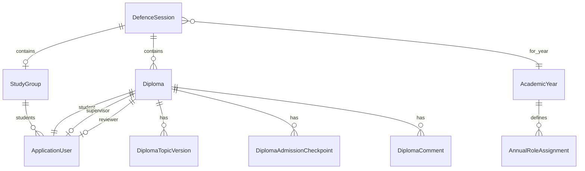

# Доменна модель (імплементація)

> Бізнес-вимоги: [wiki v1](https://github.com/bpashkovskyi/diploma-management-system/wiki).  
> Нижче — актуальна модель для коду з урахуванням рішень розробки.

## Діаграма (спрощено)



## Ключові рішення

### 1. `StudyGroup` → одна `DefenceSession`

- Кожна **група** належить **не більше ніж одній** сесії захисту.
- `StudyGroup.DefenceSessionId` (nullable до призначення).
- Сесія може об'єднувати **кілька груп** (потік), але група не може бути в двох сесіях.
- Прив'язка групи до сесії → автостворення `Diploma` для кожного студента групи.

### 2. `DefenceSession` (було `Defense`)

| Поле | Тип | Опис |
|------|-----|------|
| `Id` | Guid | PK |
| `AcademicYearId` | Guid | Навчальний рік |
| `Type` | `DefenceSessionType` | `Bachelor` \| `Master` |
| `Semester` | int? | Опційно |
| `Status` | `DefenceSessionStatus` | `Active` \| `Archived` |

Створює **адмін**.

### 3. `Diploma` (було `Work`)

Один запис на студента в межах `AcademicYear` (інваріант).

| Поле | Тип | Опис |
|------|-----|------|
| `DefenceSessionId` | Guid | Сесія |
| `StudentId` | Guid | Студент |
| `SupervisorId` | Guid? | Керівник |
| `ReviewerId` | Guid? | Рецензент |
| `SupervisorAssignmentStatus` | enum | `Pending` \| `Confirmed` \| `Rejected` |
| `ReviewAssignmentStatus` | enum | `NotAssigned` \| `Assigned` \| `Completed` |
| `LifecycleStatus` | enum | Див. implementation-plan |
| `AdmissionStatus` | enum | `NotAdmitted` \| `Admitted` |
| `DefenceDate` | DateOnly? | Дата захисту (на студента) |
| `RowVersion` | uint | Concurrency |

### 4. Документи в v1 — **без файлів**

`WorkDocument` / завантаження файлів → **v2** (Google Drive API).

У v1 — `DiplomaAdmissionCheckpoint`:

| Поле | Опис |
|------|------|
| `DiplomaId` | FK |
| `Type` | `AdmissionCheckpointType` |
| `IsCompleted` | bool |
| `FormattingReviewOutcome` | тільки для `FormattingReview` |
| `Comment` | коментар (обов'язковий для зауважень / відмови нормоконтролю) |
| `CompletedById` | хто зафіксував |
| `CompletedAt` | коли |

Типи checkpoint (4 обов'язкові на допуск):

1. `SupervisorFeedback` — керівник відмічає готовність
2. `ExternalReview` — рецензія (після призначення рецензента)
3. `AntiPlagiarismClearance` — відповідальний за антиплагіат
4. `FormattingReview` — нормоконтролер (outcome + comment)

### 5. Готовність до допуску (v1)

```
ReadyForAdmission =
  SupervisorAssignmentStatus == Confirmed
  AND latest DiplomaTopicVersion.Status == Approved
  AND all 4 DiplomaAdmissionCheckpoint.IsCompleted
  AND FormattingReview outcome IN (Approved, ApprovedWithRemarks)
```

`AdmissionStatus = Admitted` — лише **вручну** секретарем (`ExamCommissionSecretary`).

### 6. Інші сутності

| Сутність | Призначення |
|----------|-------------|
| `AcademicYear` | `Label`: `2025/2026` |
| `StudyGroup` | `Name`, `DefenceSessionId?` |
| `ApplicationUser` | `Email`, `FullName`, `UserKind` (`Student` \| `Employee`), `StudyGroupId?` |
| `AnnualRoleAssignment` | `AcademicYearId`, `EmployeeId`, `AnnualRoleType` |
| `SupervisorPoolEntry` | `DefenceSessionId`, `EmployeeId` |
| `DiplomaTopicVersion` | версії теми, історія відхилень |
| `DiplomaComment` | коментарі по диплому |
| `AuditLog` | override секретаря, зміни статусів |

## Інваріанти

1. Студент — **≤ 1 активного** `Diploma` на `AcademicYear`.
2. `StudyGroup.DefenceSessionId` — unique constraint (одна група — одна сесія).
3. Після `DiplomaTopicVersion.Approved` — нові версії **заборонені**.
4. `DefenceSession.Archived` → усі зміни заборонені (read-only).
5. Checkpoint-и створюються при переході в `DocumentsInProgress` (4 записи на диплом).

## v2 (не в цій моделі)

- `DiplomaDocument` + Google Drive file references
- Gaidet — декларація про використання ШІ
- Файл дипломної роботи, тези, презентація

Див. [wiki v2-roadmap](https://github.com/bpashkovskyi/diploma-management-system/wiki/v2-Roadmap).
